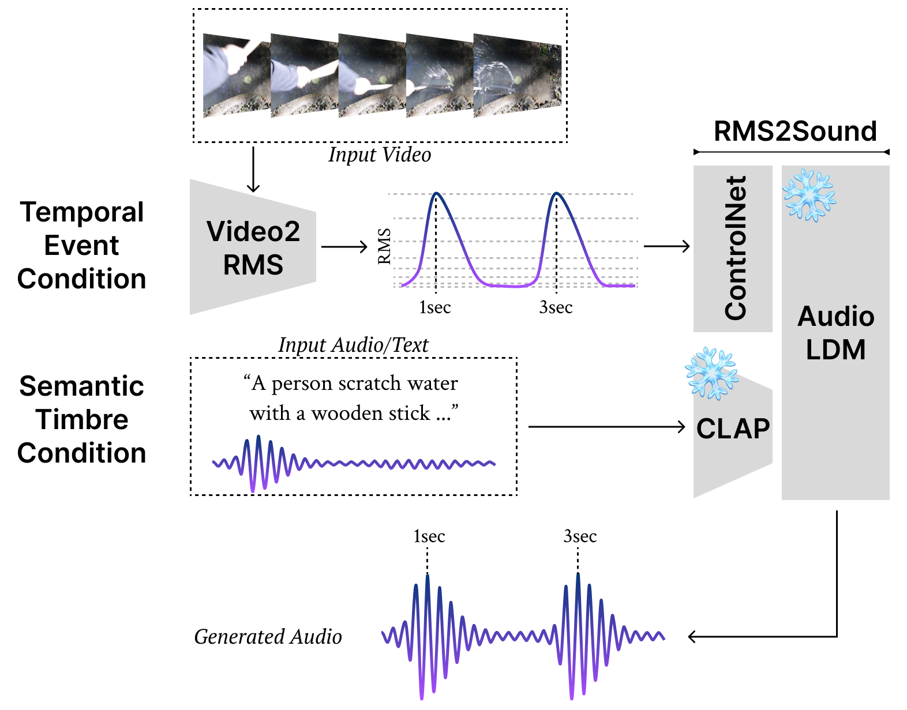

# Video-Foley

Official PyTorch implementation of "Video-Foley: Two-Stage Video-To-Sound Generation via Temporal Event Condition For Foley Sound".
Keywords: Video-to-Audio Generation, Controllable Audio Generation, Multimodal Deep Learning.

[](https://arxiv.org/abs/2408.11915)  [](https://jnwnlee.github.io/video-foley-demo/)  [](https://huggingface.co/jnwnlee/video-foley)


<table>
  <tr>
    <td></td>
    <td><a href="https://www.youtube.com/watch?v=5FWNL6KoL08">
      
   </a></td>
  </tr>
</table>

# Contents
----

* [Usage Guide](#usage-guide)
   * [(TL;DR) Inference with your own video](#tldr-inference-with-your-own-video)
   * [Getting Started](#getting-started)
      * [Installation](#installation)
      * [Download Datasets](#download-datasets)
      * [Download Pre-trained Models](#download-pre-trained-models)
   * [Data Preprocessing](#data-preprocessing)
   * [Training Video2RMS](#training-video2rms)
   * [Evaluate Video2RMS](#evaluate-video2rms)
   * [Inference (Video-to-Sound Generation)](#inference-video-to-sound-generation)
   * [Evaluate Generated Audio](#evaluate-generated-audio)
* [Citation](#citation)
   * [References](#references)


----
# Usage Guide

### (TL;DR) Inference with your own video
To make an end-to-end inference with your own video without processing the whole dataset, run `infer_by_video.py`.
This script executes preprocessing, video2rms inference, and rms2sound inference.
Each video should be at least 10 seconds long.

(text prompt)
```bash
python infer_by_video.py --video_dir ./dir/to/your/videos --prompt_type "text" \
   --prompt "A person hit metal with a wooden stick." "A person hit cup with a wooden stick." ... \ 
   --epoch 500 --video2rms_ckpt_dir ./dir/to/video2rms/ckpt --rms2sound_ckpt_dir ./dir/to/rms2sound/ckpt \
   --output_dir ./output_dir
```

(audio prompt)
```bash
python infer_by_video.py --video_dir ./dir_to_your_videos --prompt_type "audio" \
   --prompt ./path/to/audio_1.wav ./path/to/audio_2.wav ... \
   --epoch 500 --video2rms_ckpt_dir ./dir/to/video2rms/ckpt --rms2sound_ckpt_dir ./dir/to/rms2sound/ckpt \
   --output_dir ./output_dir
```

```video_dir``` should look like this:
```
dir/to/your/videos/
├── your_video_1.mp4
├── your_video_2.mp4
└── ...
```

## Getting Started

### Installation
1. Clone this repository.
   ```bash
   git clone --recurse-submodules https://github.com/jnwnlee/video-foley
   cd video-foley
   ```

2. Create a new Conda environment.
   ```bash
   conda create -n v2s python=3.9.18
   conda activate v2s
   ```

3. Install [PyTorch](https://pytorch.org/get-started/previous-versions) and other dependencies.
   ```bash
   conda install pytorch==2.1.1 torchvision==0.16.1 torchaudio==2.1.1 pytorch-cuda=11.8 -c pytorch -c nvidia
   conda install ffmpeg=6.1.0 x264 -c conda-forge # this may take long
   pip install -r requirements.txt
   ```

4. RMS2Sound submodule (RMS-ControlNet) init
   1. If you didn't clone this repo with --recurse-submodules option, run the following commands to initialize and update submodules.
   ```bash
   # after executing:
   # git clone https://github.com/jnwnlee/video-foley
   # cd video-foley
   git submodule init
   git submodule update
   ```
   2. Install requirements as follows:
   ```bash
   conda install lightning -c conda-forge
   pip install -e ./RMS_ControlNet_Inference
   pip install -e ./RMS_ControlNet_Inference/AudioLDMControlNetInfer/Model/AudioLdm
   pip install -e ./RMS_ControlNet_Inference/TorchJAEKWON
   ```
   Refer to [this repo](https://github.com/jakeoneijk/RMS_ControlNet_Inference) for further details.

### Download Datasets
For GreatestHits dataset, download 'full-res videos and labels' in this website: [Visually Indicated Sounds](https://andrewowens.com/vis/).

```bash
unzip ./data/vis-data.zip -d ./data/GreatestHits
```


### Download Pre-trained Models
Download weigths by cloning a repo in Huggingface to target path (here, ```./ckpt```).
```bash
conda install git-lfs -c conda-forge
# (or) sudo apt-get install git-lfs
git clone https://huggingface.co/jnwnlee/video-foley ./ckpt
```

Or, manually download each files through links provided by Huggingface:
```bash
wget url/for/download/
```


## Data Preprocessing
Run `data_preprocess.sh` to preprocess data and extract RGB and optical flow features. 

Notice: The script we provided to calculate optical flow is easy to run but is resource-consuming and will take a long time. We strongly recommend you to refer to [TSN repository][TSN] and their built [docker image][TSN_docker] (our paper also uses this solution)  to speed up optical flow extraction and to restrictly reproduce the results.
(GreatestHits dataset)
```bash
source data_preprocess_GreatestHits.sh
```


## Training Video2RMS
Training Video2RMS from scratch. The results will be saved to {save_dir}.

(change config.py before executing python script: e.g., save_dir, rgb_feature_dir, flow_feature_dir, mel_dir, etc.)
```bash
CUDA_VISIBLE_DEVICES=0 python train.py
```

In case that the program stops unexpectedly, you can continue training.
```bash
CUDA_VISIBLE_DEVICES=0 python train.py \
-c path/to/.yml/file \
train.checkpoint_path path/to/checkpoint/file
```


## Evaluate Video2RMS
Evaluate Video2RMS with GreatestHits dataset test split.
The metrics mentioned in the paper will be saved as a csv file (```./evaluate.csv```). (check config.log.loss.types in opts.yml)
The checkpoint directory ('-c', '--ckpt_dir') should contain both 'opts.yml' file (configuration) and model weights.

```bash
CUDA_VISIBLE_DEVICES=0 python evaluate.py -c path/to/video2rms/ckpt -e 500 -a micro -o ./evaluate.csv
```


## Inference (Video-to-Sound Generation)
Generate audio from video, using Video2RMS and RMS2Sound.
You can choose either 'audio' or 'text' as a type of semantic prompt.
(- audio: use ground-truth audio as a prompt in ```config.data.audio_src_dir```)
(- text: use text made with annotation in ```config.data.annotation_dir``` as a prompt)
Each checkpoint directory should contain the followings:
- Video2RMS: config (```opts.yml```) and model weight (e.g., ```checkpoint_000500_Video2RMS.pt```)
- RMS2Sound: model weight ```ControlNetstep300000.pth```

Outputs (generated audio and video paired with generated audio) will be saved to ```output_dir/{audio/video}```, respectively.

```bash
CUDA_VISIBLE_DEVICES=0 python infer.py -v path/to/video2rms/ckpt -r path/to/rms2sound/ckpt \
   -e 500 -o path/to/output_dir -p "audio/text"
```


## Evaluate Generated Audio
Evaluate generated audio with ground truth audio.
This code is only for E-L1 and CLAP score calculation.
(For CLAP score, please download the model weigt [here](https://huggingface.co/lukewys/laion_clap/blob/main/music_speech_audioset_epoch_15_esc_89.98.pt))
(For FAD calculation, please refer to [fadtk](https://github.com/DCASE2024-Task7-Sound-Scene-Synthesis/fadtk))
Gather audio files only in ```--generated_dir``` and ```--ground_truth_dir```, respectively.
The audio files in ```--generated_dir``` and ```--ground_truth_dir``` should have the same name. (not necessary for FAD)
The calculated scores will be saved as a csv file (```./eval_v2s_audio.csv```).

```bash
CUDA_VISIBLE_DEVICES=0 python evaluate_v2s.py --el1 --clap \
   --clap_pretrained_path ./ckpt/clap_music_speech_audioset_epoch_15_esc_89.98.pt \
   --ground_truth_dir path/to/ground_truth_audio \
   --generated_dir path/to/generated_audio \
   --csv_path eval_v2s_audio.csv
   # (for text prompt using annotations) --annotation_dir /mnt/GreatestHits/vis-data/
```

```bash
# If you don't use pytorch~=2.1.x, we recommend to create new conda environment.
# conda create -n fadtk python=3.10 && conda activate fadtk
# conda install pytorch==2.1.1 torchvision==0.16.1 torchaudio==2.1.1 pytorch-cuda=11.8 -c pytorch -c nvidia # example
# pip install chardet scipy==1.11.2
pip install git+https://github.com/DCASE2024-Task7-Sound-Scene-Synthesis/fadtk.git
fadtk panns-wavegram-logmel path/to/ground_truth_audio path/to/generated_audio fad_result.csv --inf
```


# Citation
```bibtex
@article{video-foley,
          title={Video-Foley: Two-Stage Video-To-Sound Generation via Temporal Event Condition For Foley Sound},
          author={Lee, Junwon and Im, Jaekwon and Kim, Dabin and Nam, Juhan},
          journal={arXiv preprint arXiv:2408.11915},
          year={2024}
        }
```


### References
- [REGNET](https://arxiv.org/abs/2008.00820)
- [TSN](https://github.com/yjxiong/temporal-segment-networks)
- [JDCNet](https://github.com/dansuh17/jdcnet-pytorch)
- [CondFoleyGen](https://github.com/XYPB/CondFoleyGen)
- [AudioLDM](https://github.com/haoheliu/AudioLDM-training-finetuning)
- [ControlNet](https://github.com/lllyasviel/ControlNet)
- [RAFT](https://pytorch.org/vision/main/models/generated/torchvision.models.optical_flow.raft_large.html)
